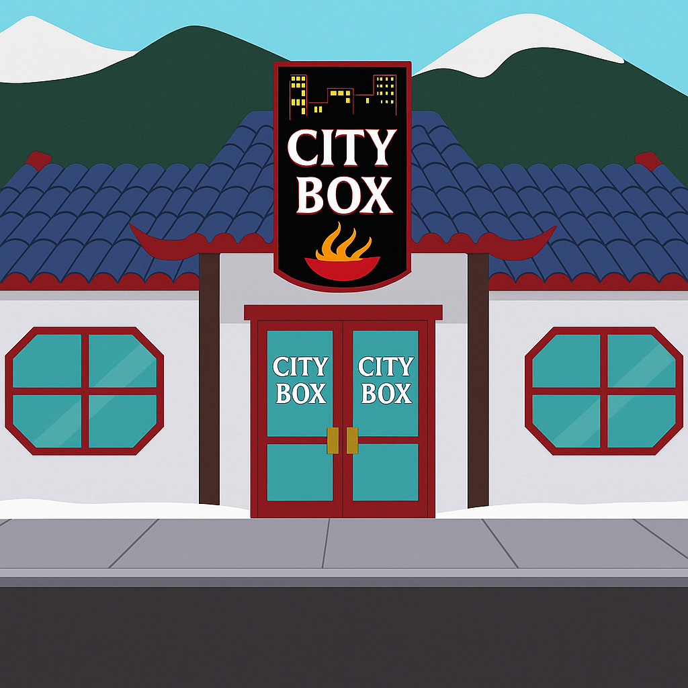

# CityBox

A complete system that provides a portable *NIX environment

## Commands
touch
stat
echo
less
ls
tree (ls -t/v)
cd
mkdir
stat
rm
mv
cp
pwd
fd (find)
rg (grep)
cat
du
df
oro -h -t
wc
ping
vi
sed
(see Basic Linux Commands in ppt)

Regular Expressions

## Shell
help
setenv
which
date
cal

## Options
use argtables
-h: human readable
--help: help
